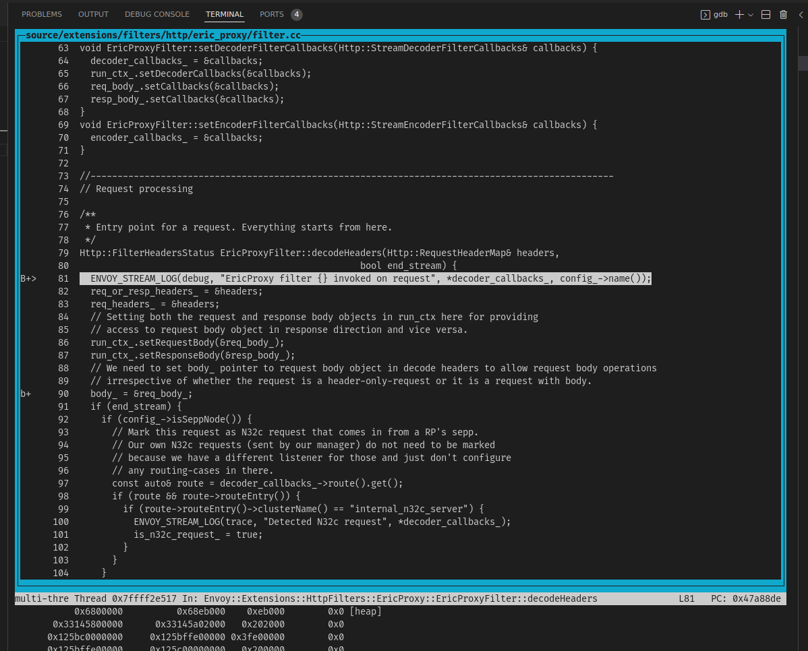
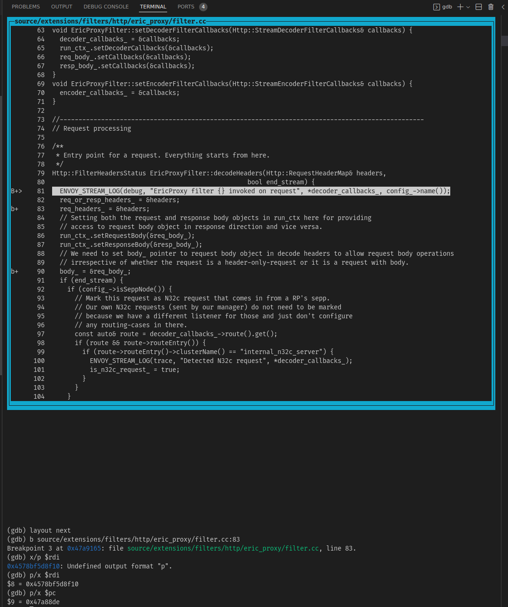
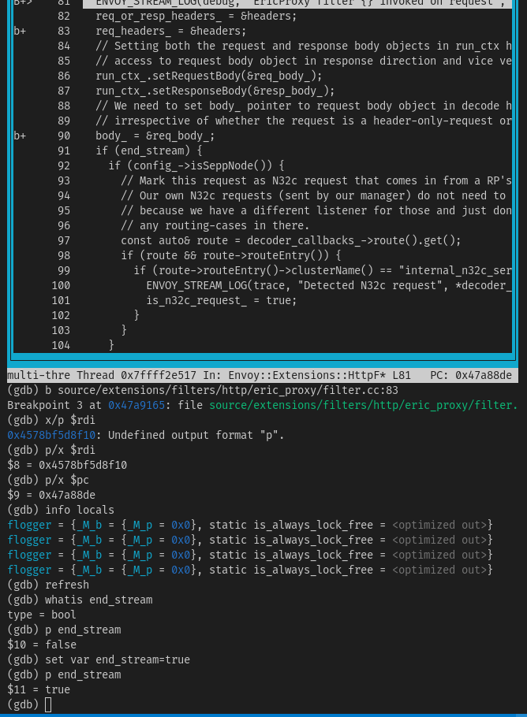
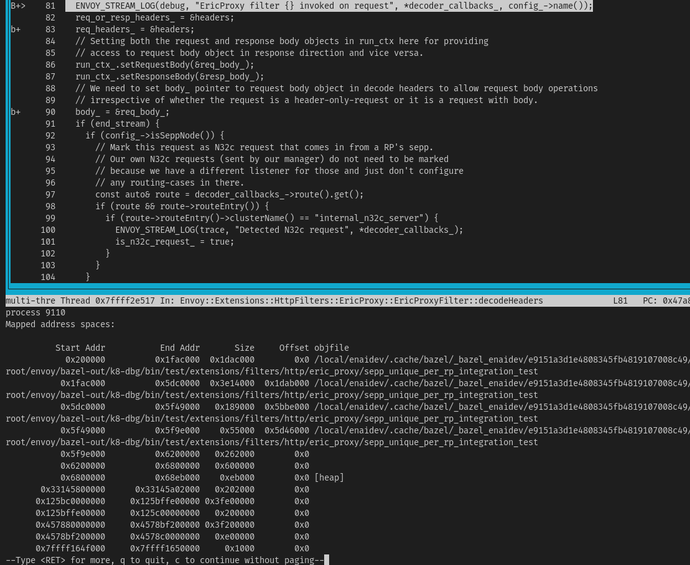
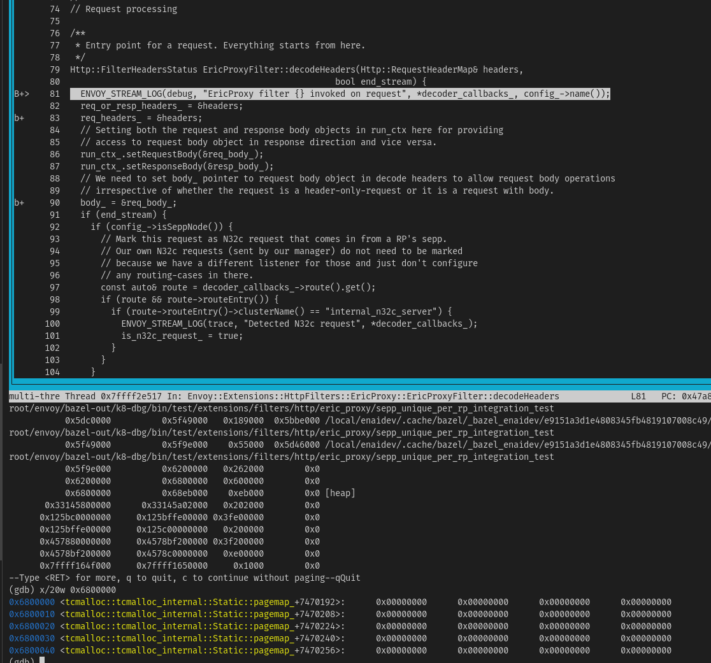

# GDB Tips for Envoy debugging 
Checkout Alex's doc on coredump retrieval if you're dealing with a coredump file https://eteamspace.internal.ericsson.com/pages/viewpage.action?spaceKey=DSCNode&title=Retrieving+and+Using+Core-Dumps
## 1.  Build test files and dwarf package (dwp) with debug symbols 
    $ bazel build -c dbg //test/extensions/filters/http/eric_proxy:sepp_unique_per_rp_integration_test 
    $ bazel build -c dbg //test/extensions/filters/http/eric_proxy:sepp_unique_per_rp_integration_test.dwp  
## 2. Run test in gdb
    $ gdb bazel-bin/extensions/filters/http/eric_proxy/sepp_unique_per_rp_integration_test
## 3. Enter in TUI mode  
Repeat Until you find a disassembly window you're comfortable with

    (gdb) layout next 

## 4. Add a breakpoint
    (gdb) b source/extensions/filters/http/eric_proxy/filter.cc:83
Puts a breakpoint at line 83 on the eric_proxy/filter.cc code
## 6. Local variable state 
Much of the things described here can be found at https://ftp.gnu.org/old-gnu/Manuals/gdb/html_node/gdb_50.html#SEC51
. These are some handy commands that give relevant information quickly

    (gdb) p headers
Would print the state of variable header within stack frame
   
    (gdb) p/x $pc
Would print state of Program Counter. Similarly other x86 registers like rdi, rsi etc. Register information can be important because on a function invocation arguments and return  values are stored in registers associated with the CPU architecture ( See man syscall for complete list of ABI spec. explaining the argument-index-to-register mapping)

 

If you wish to alter the state of any variable  
<pre>(gdb) set var <i>var-name</i></pre>

Other commands that are often useful and self explanatory -
    
    (gdb) p *this
    (gdb) info frame
    (gdb) info locals
    (gdb) info args
    (gdb) where [ prints out the function call hierarchy ]

## 5. View Memory map
To view memory map of the test under debugger / coredump file

    (gdb) info proc mapping

From the result we can see that heap is of length 0xeb000 starting from address 0x6800000
Then we can print out 20 word (each word is 4 byte) region from starting address of heap.
More details about glibc heap malloc procedure can be found at 
https://sourceware.org/glibc/wiki/MallocInternals (Similar to tcmalloc [by Google] used in envoy).
Also note that since there is a separate heap per thread due to ptmalloc2 separating heap and 
freelist per thread, the map that we see is of the thread calling in the associated frame and not 
for the entire process (See Envoy threading model).
 
(TODO a summary of the procedure)  
 

The address location increases from left to right. That is the first word is 0x0 - 0x3 next word is 0x4 - 0x7 till last one is 0xc - 0xe. Most CPU's today are little-endian meaning lower order data are stored in lower order addresses. For ex. if 

    char * arr = (char *) malloc(sizeof(4*char*));
    strncpy(arr,"XYZ",4);

arr[0] = X, arr[1] = Y, arr[2] = Z;

so the malloc would fill addr *(0x00) = Z, *(0x01) = Y and *(0x02) = X 

so in a heap map it will appear as 0x..'Z''Y''X'  (It appears reversed but in terms of allocation by program it makes sense)

If the function names are mangled, turn it off using 

    (gdb) set print asm-demangle on
 

Run through code by pressing 'n', till a heap allocation occurs 

## 6. Use-after-free explanation from heap map
    (TODO)

